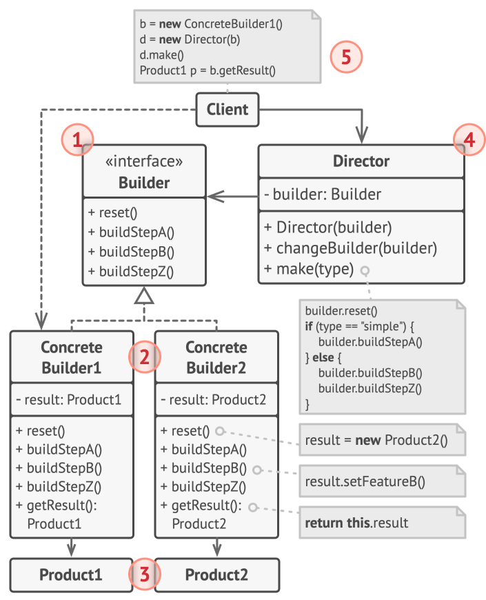

## Intent

**Builder** is a creational design pattern that lets you construct complex objects step by step. The pattern allows you to produce different types and representations of an object using the same construction code.

## UML Diagram

## Applicability

- Use the Builder pattern to get rid of a “telescoping constructor”.

- Use the Builder pattern when you want your code to be able to create different representations of some product.

- Use the Builder to construct Composite trees or other complex objects.
