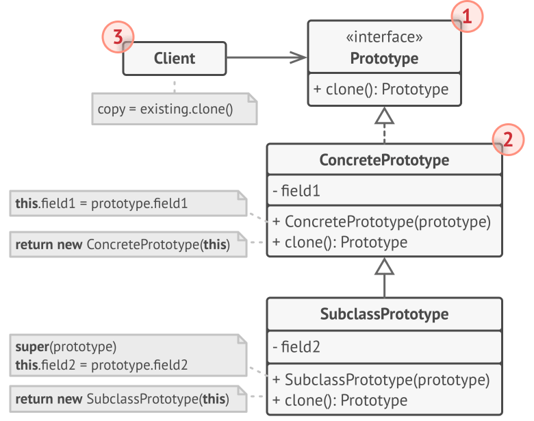

## Intent

**Prototype** is a creational design pattern that lets you copy existing objects without making your code dependent on their classes.

## Aplicability

- Use the Prototype pattern when your code shouldn’t depend on the concrete classes of objects that you need to copy.

- Use the pattern when you want to reduce the number of subclasses that only differ in the way they initialize their respective objects.