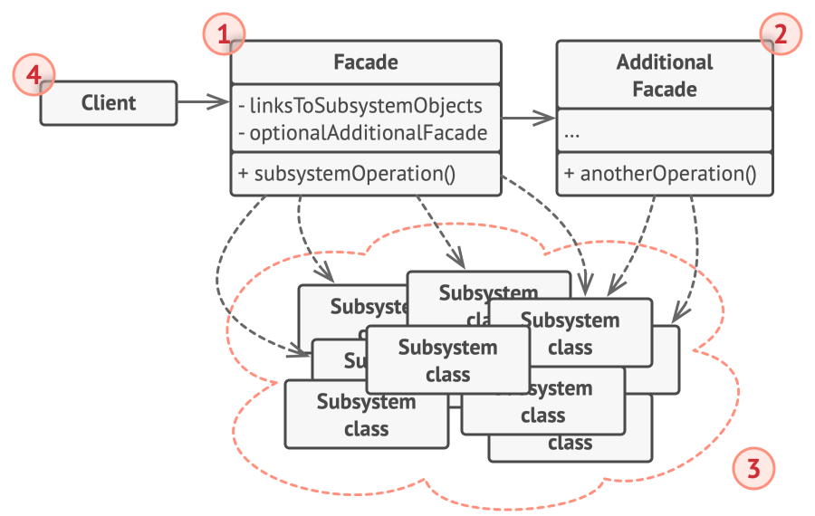

## Intent

**Facade** is a structural design pattern that provides a simplified interface to a library, a framework, or any other complex set of classes.

## UML Diagram

## Aplicability

- Use the Facade pattern when you need to have a limited but straightforward interface to a complex subsystem.

- Use the Facade when you want to structure a subsystem into layers.

## Pros

- You can isolate your code from the complexity of a subsystem.

## Cons

-  A facade can become a god object coupled to all classes of an app.